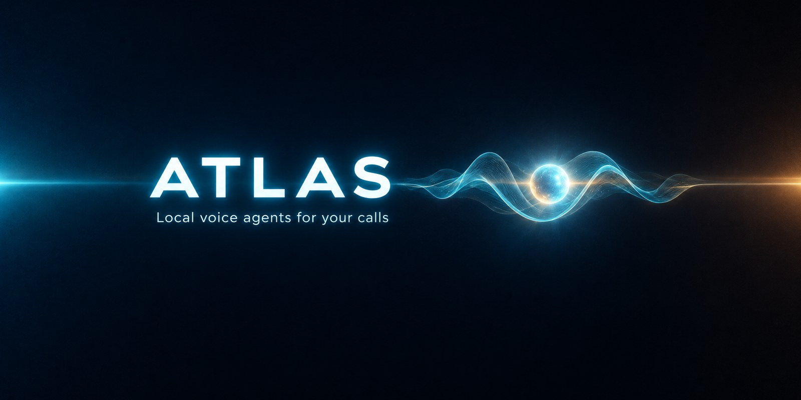
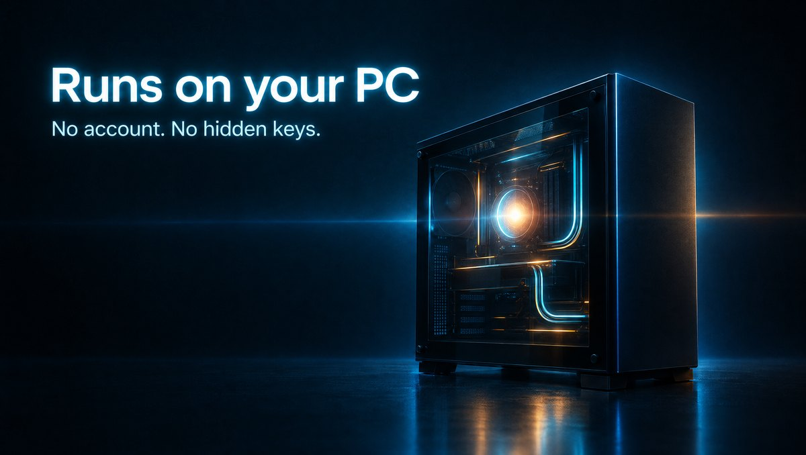
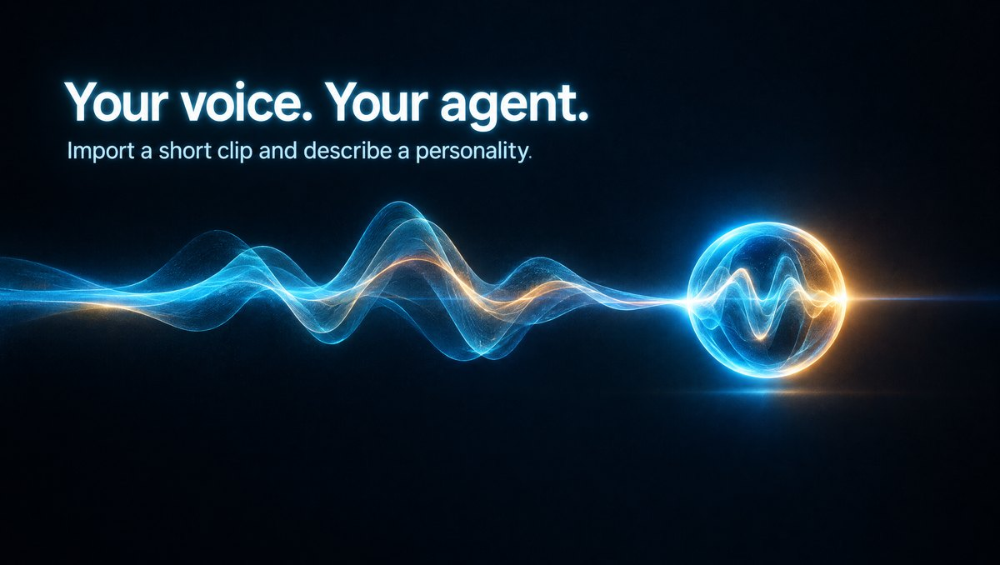
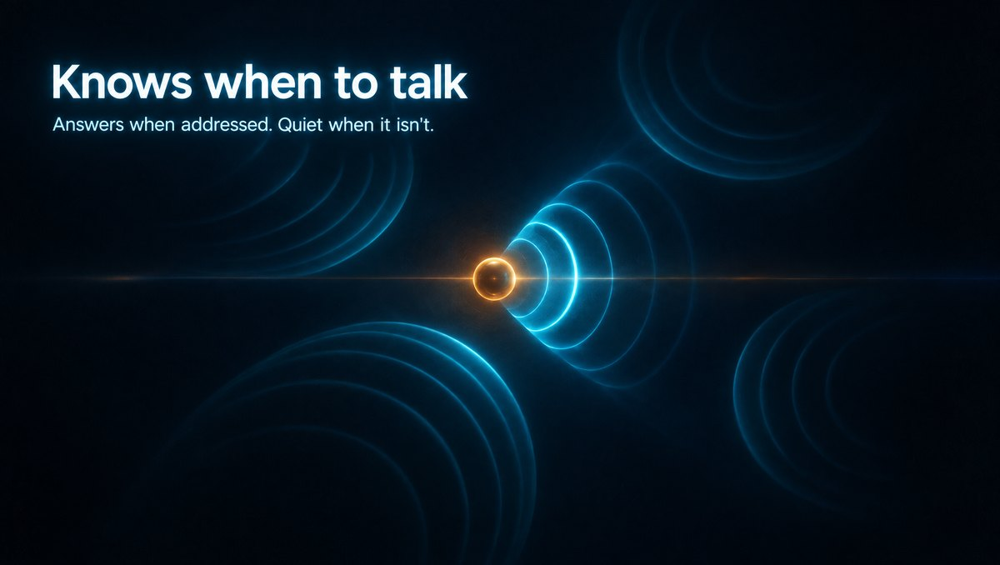
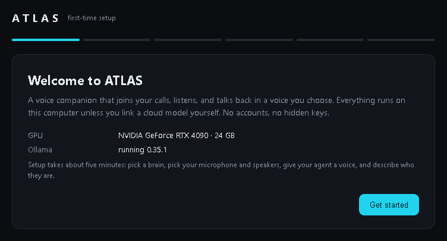

<p align="center"></p>

<p align="center">
  <a href="https://github.com/Relic-Studios/atlas/releases/latest"><b>Download for Windows</b></a> ·
  <a href="#linux">Linux</a> ·
  <a href="#requirements">Requirements</a> ·
  <a href="CHANGELOG.md">Changelog</a> ·
  <a href="https://discord.gg/dWvcu3yG6s">Community Discord</a>
</p>

# ATLAS

Local voice agents that join your voice calls, listen, and talk back in a voice you choose.
Everything runs on your PC. No account, no bundled API keys.

<p align="center">
  
  
  
</p>

- **Runs on your PC.** Listening, the voice and (if you choose) the language model all run locally.
- **Your voice, your agent.** Import a 10–20 second clip, describe a personality, and ATLAS drafts the agent for you to edit.
- **Knows when to talk.** In a group call it answers when it's addressed and stays quiet when it isn't.
- **Learns names.** It picks up people's names from introductions instead of calling them "Speaker 3".
- **You stay in control.** Instant mute, quiet mode, a talkativeness slider, mute a specific speaker, and a report after each call.

## Install

### Windows

1. Download **`ATLAS-Setup-<version>.exe`** from the [latest release](https://github.com/Relic-Studios/atlas/releases/latest) and run it.
   It installs Python 3.12 and Node.js if they're missing, a private Python environment,
   PyTorch (CUDA), the app, and the speech models (~4 GB). This takes a while the first time.
2. Open **ATLAS** from the desktop shortcut.

> Windows may show a SmartScreen warning because the installer isn't code-signed yet.
> Click **More info → Run anyway**.

From source instead: clone this repo and double-click **Install ATLAS.cmd**
(or `powershell -ExecutionPolicy Bypass -File install.ps1`). Options: `-SkipModels`, `-NoShortcut`.
A log is written to `install.log`.

### Linux

Ubuntu 22.04+ with an NVIDIA driver installed:

```bash
git clone https://github.com/Relic-Studios/atlas.git && cd atlas
bash install.sh   # asks for sudo once for system packages
```

## First launch

<p align="center"></p>

The setup wizard walks you through:

1. **Language model**
   - **Local (recommended with 12 GB+ of VRAM):** ATLAS finds Ollama (or offers to install it),
     recommends a model sized for your GPU, downloads it with progress, and checks it can follow
     ATLAS's reply format before saving it.
   - **Cloud:** any OpenAI-compatible provider (OpenRouter, Together, Groq, OpenAI, your own vLLM server).
     Paste your own key; it's stored only in `user/settings.json` on this PC and never shown again in full.
     The same reply-format check runs against your provider.
2. **Audio:** pick the input the agent listens on and the output it speaks to.
   To bring it into an online voice call (any app), route the call into a virtual cable (e.g. VB-Audio Voicemeeter)
   and pick that cable here.
3. **Voice:** import a 10–20 second clean clip of the voice you want (WAV/MP3), plus what's said in it.
   Until you do, ATLAS uses a neutral starter voice generated on your PC.
4. **Agent:** describe a personality, let ATLAS draft it, edit the text, and save. Or import a `heart.md`.

You can change all of this later from the dashboard.

## Requirements

- Windows 10/11 or Ubuntu 22.04+, 16 GB RAM, ~15 GB disk (plus the local model, if you use one).
- **An NVIDIA GPU is required.** Listening and the voice use about 6 GB of VRAM.

| Your GPU | What works |
|---|---|
| 8–11 GB (e.g. RTX 3060 Ti, 4060) | ATLAS with a **cloud** model |
| 12–15 GB (e.g. RTX 3060 12 GB, 4070) | Fully local with Qwen3 8B (minimum tested) |
| 16 GB+ (e.g. RTX 4080, 4090, 5090) | Fully local with Qwen3 14B (recommended) |

Smaller local models (4B and under) were benchmarked and can't keep up with a group call.

## Community

Questions, install help, persona and voice tips, clips: join the [ATLAS community Discord](https://discord.gg/dWvcu3yG6s).
Bugs can also go in [GitHub issues](https://github.com/Relic-Studios/atlas/issues); security reports go through [SECURITY.md](SECURITY.md), not public channels.

## Privacy

Audio, transcripts and memories stay on your PC. The server only listens on this computer (127.0.0.1).
Web searches (when an agent looks something up) and cloud model calls (only if you chose a cloud provider)
are the only things that leave it.

Only use voices you have the right to use.
